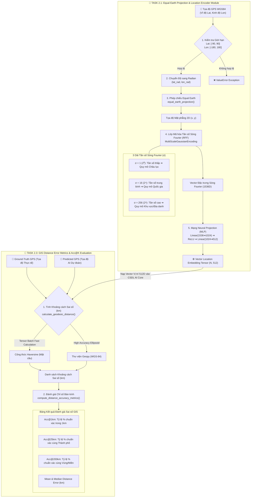

# 🌍 GeoCLIP Vietnam Visualization (`GeoCLIP-Vietnam-Viz`)

> **Đồ án môn Phân tích và Trực quan hóa Dữ liệu — Trường Đại học Công nghệ Thông tin (UIT - VNU-HCM)**  
> Ứng dụng mô hình AI **GeoCLIP (ICCV 2023)** để dự đoán vị trí địa lý (Vĩ độ Lat, Kinh độ Lon) từ một bức ảnh bất kỳ, hỗ trợ định vị địa danh và trực quan hóa bản đồ tương tác.

---

## 📖 1. Giới thiệu Dự án

Khi bạn chụp một bức ảnh phong cảnh hoặc công trình kiến trúc nhưng không bật GPS hoặc ảnh bị xóa siêu dữ liệu (EXIF), **làm sao máy tính có thể đoán được bức ảnh đó được chụp ở đâu trên Trái Đất?**

Dự án này ứng dụng kiến trúc mạng nơ-ron **GeoCLIP (Contrastive Vision-Location Matching)**:
1. **Khối Thị giác (Image Encoder)**: Sử dụng mô hình lớn **CLIP ViT-L/14** (OpenAI) để nhận diện các đặc trưng cảnh quan, màu sắc, kiến trúc trong ảnh và nén thành **Vector 512 chiều**.
2. **Khối Không gian (Location Encoder)**: Sử dụng phép chiếu **Equal Earth** và sóng tần số đa tỉ lệ **Random Fourier Features (RFF)** để mã hóa tọa độ GPS $(Lat, Lon)$ thành **Vector 512 chiều**.
3. **Bộ so khớp (Cosine Matcher)**: Đo góc tương đồng $(\cos \theta)$ giữa Vector Ảnh và hàng chục nghìn Vector Vị trí để tìm ra **Top-K vị trí có xác suất cao nhất**, kèm đường dẫn xem trực tiếp trên **Google Maps**.

```text
 🖼️ [Ảnh Đầu vào] ───────> ImageEncoder ───────> Vector Ảnh (1, 512) ──┐
                                                                       ├──> Cosine Matcher ──> 📍 Top-5 GPS & Google Maps
 📍 [Thư viện Tọa độ] ───> LocationEncoder ────> Vector GPS (M, 512) ──┘
```

---

## 📂 2. Cấu trúc Thư mục Dự án

```text
GeoCLIP-Vietnam-Viz/
├── 📘 README.md                  # Hướng dẫn chi tiết dự án (file này)
├── 📋 PLAN_TEAM.md               # Kế hoạch phân công công việc 2 tuần cho nhóm
├── 📄 requirements.txt           # Danh sách các thư viện Python phụ thuộc
├── 📄 .gitignore                 # Cấu hình bỏ qua các file tạm / cache
├── ⚡ demo_cli.py                 # Script chạy thử nghiệm dự đoán nhanh qua dòng lệnh
├── 🖥️ app.py                     # Giao diện Web Dashboard Streamlit
│
├── 📂 weights/                   # Thư mục chứa trọng số mạng nơ-ron (.pth)
│   ├── image_encoder_mlp_weights.pth
│   ├── location_encoder_weights.pth
│   └── logit_scale_weights.pth
│
├── 📂 data/                      # Dữ liệu Tọa độ & Ảnh mẫu
│   ├── coordinates_100K.csv     # 100,000 tọa độ phân bố toàn cầu (Chuẩn GeoCLIP)
│   ├── vietnam_landmarks.csv    # Tọa độ các địa danh nổi tiếng Việt Nam
│   ├── hotosm_vnm_points_of_interest_points_geojson.geojson # 84k điểm POI Việt Nam
│   └── 📂 sample_images/        # Thư mục ảnh mẫu để kiểm thử (Kauai.png, images.jpg...)
│
├── 📂 src/                       # Mã nguồn mô-đun hóa chính của hệ thống
│   ├── 📂 core/                  # [Lõi AI Core]
│   │   ├── image_encoder.py     # Trích xuất đặc trưng thị giác (Vision Backbone)
│   │   ├── location_encoder.py  # Mã hóa không gian đa tần số (Location Backbone)
│   │   ├── matcher.py           # Tính Cosine Similarity & Softmax Top-K
│   │   └── pipeline.py          # Class GeoCLIPService API tích hợp trung tâm
│   │
│   ├── 📂 gis/                   # [Module GIS & Đo đạc Sai số]
│   │   ├── projections.py       # Phép chiếu bản đồ Equal Earth
│   │   ├── rff_layers.py        # Lớp mã hóa Fourier Gaussian (RFF)
│   │   └── distance_metrics.py  # Tính khoảng cách sai số Geodesic (km) & Acc@K
│   │
│   └── 📂 viz/                   # [Module Trực quan hóa]
│       └── map_builder.py       # Dựng bản đồ tương tác Folium / Leaflet Heatmap
│
└── 📂 docs/                      # Sơ đồ kiến trúc & Hình ảnh tài liệu
    └── workflow_task_1_2_cosine_matcher.png
```

---

## 👥 3. Phân công Vai trò Nhóm (5 Thành viên)

| Vai trò | Phụ trách | Nhiệm vụ chính | Thư mục đảm nhận |
| :--- | :--- | :--- | :--- |
| **Tech Lead (Dev 1)** | Bạn | Thiết kế AI Core, Service Pipeline, Tối ưu bộ nhớ | `src/core/`, `demo_cli.py` |
| **GIS Engineer (Dev 2)** | Thành viên 2 | Phép chiếu Equal Earth, RFF, Đánh giá sai số (km) | `src/gis/`, `data/`, `notebooks/` |
| **Frontend UI (3 Devs)** | Thành viên 3, 4, 5 | Xây dựng Web Dashboard Streamlit & Bản đồ tương tác | `src/viz/`, `app.py` |

---

### 🗺️ 3.1 Sơ đồ Luồng Công việc Module GIS (GIS Engineer Workflow - Task 2.1 & Task 2.3)


Sơ đồ bên dưới thể hiện quy trình xử lý không gian từ tọa độ GPS thô cho đến khi xuất ra **Vector Vị trí 512D** (Task 2.1) và **Đo đạc Bảng sai số khoảng cách Acc@K** (Task 2.3):



---


## 🚀 4. Hướng dẫn Cài đặt & Chạy cho Người mới (Quickstart)

### 🔹 Bước 1: Mở Terminal / Command Prompt
Mở **Command Prompt (CMD)** hoặc **PowerShell** và chuyển vào thư mục dự án:
```cmd
cd D:\uit\ky3\lt_python\GeoCLIP-Vietnam-Viz
```

### 🔹 Bước 2: Kích hoạt Môi trường ảo (Virtual Environment)
Nếu bạn đã có môi trường ảo `venv`:
```cmd
.\venv\Scripts\activate
```
*(Nếu chưa cài thư viện, chạy lệnh: `pip install -r requirements.txt`)*

---

### 🔹 Bước 3: Chạy Thử nghiệm Dự đoán Nhanh (CLI Demo)

Chạy với ảnh mẫu mặc định:
```cmd
python demo_cli.py
```

Hoặc truyền đường dẫn một bức ảnh bất kỳ của bạn:
```cmd
python demo_cli.py data/images.jpg
```

**Kết quả hiển thị trên màn hình:**
```text
=================================================================
      🌍 GEOCLIP VIETNAM VISUALIZATION - CLI PREDICTION DEMO
=================================================================
[+] Đang nạp mô hình và quét ảnh: Kauai.png...
[GeoCLIPService] Reading Global GPS Gallery: coordinates_100K.csv...
[GeoCLIPService] Loaded 94,123 Global GPS coordinates into Gallery!
[GeoCLIPService] Pre-encoding Location Embeddings...
[GeoCLIPService] Global Location Embeddings Ready! Matrix Shape: torch.Size([94123, 512])

[+] Đang tiến hành dự đoán Top-5 vị trí địa lý...

=================================================================
               📍 KẾT QUẢ DỰ ĐOÁN TOP-5 VỊ TRÍ
=================================================================
Hạng #1: Vĩ độ =  22.197973, Kinh độ = -159.621902 | Xác suất:   7.26%
        🔗 Google Maps: https://www.google.com/maps?q=22.197973,-159.621902
Hạng #2: Vĩ độ =  22.178503, Kinh độ = -159.650055 | Xác suất:   7.01%
        🔗 Google Maps: https://www.google.com/maps?q=22.178503,-159.650055
Hạng #3: Vĩ độ =  22.175880, Kinh độ = -159.654221 | Xác suất:   6.77%
        🔗 Google Maps: https://www.google.com/maps?q=22.175880,-159.654221
Hạng #4: Vĩ độ =  22.175119, Kinh độ = -159.655899 | Xác suất:   6.67%
        🔗 Google Maps: https://www.google.com/maps?q=22.175119,-159.655899
Hạng #5: Vĩ độ =  22.150225, Kinh độ = -159.663559 | Xác suất:   5.27%
        🔗 Google Maps: https://www.google.com/maps?q=22.150225,-159.663559
=================================================================
[OK] Dự đoán hoàn tất thành công!
```

---

### 🔹 Bước 4: Kiểm thử Độc lập Từng Module (Unit Tests)

Bạn có thể chạy kiểm thử riêng lẻ từng module để phục vụ việc debug:

* **Test Module Ảnh (`ImageEncoder`)**:
  ```cmd
  python src/core/image_encoder.py
  ```
* **Test Module So khớp Tương đồng (`CosineMatcher`)**:
  ```cmd
  python src/core/matcher.py
  ```
* **Test Dịch vụ Tổng thể (`GeoCLIPService`)**:
  ```cmd
  python src/core/pipeline.py
  ```

---

### 🔹 Bước 5: Khởi chạy Web Dashboard (Giao diện Người dùng)
```cmd
streamlit run app.py
```
*(Trình duyệt web sẽ tự động mở tại địa chỉ: `http://localhost:8501`)*

---

## 💻 5. Cách Sử dụng `GeoCLIPService` trong Code (Dành cho Team UI)

Các thành viên làm giao diện chỉ cần gọi **3 dòng code** cực kỳ đơn giản:

```python
from src.core.pipeline import GeoCLIPService

# 1. Khởi tạo Service (tự động nạp mô hình và tạo cache)
service = GeoCLIPService()

# 2. Truyền đường dẫn ảnh hoặc đối tượng PIL.Image
predictions = service.predict("duong_dan_anh.jpg", top_k=5)

# 3. Sử dụng kết quả
for item in predictions:
    print(item['rank'], item['lat'], item['lon'], item['prob_percent'], item['gmaps_url'])
```

---

## ❓ 6. Xử lý Sự cố Thường gặp (Troubleshooting)

1. **Lỗi `ModuleNotFoundError: No module named 'src'`**:
   * *Khắc phục*: Đảm bảo bạn đang đứng ở thư mục gốc của project (`D:\uit\ky3\lt_python\GeoCLIP-Vietnam-Viz`) khi chạy lệnh.
2. **Lỗi font tiếng Việt trên Windows CMD (`UnicodeEncodeError: 'charmap' codec...`)**:
   * *Khắc phục*: File mã nguồn đã tự động bật `sys.stdout.reconfigure(encoding='utf-8')`. Nếu chạy script ngoài, hãy gõ lệnh `chcp 65001` trong CMD trước khi chạy.

---

## 📚 7. Tài liệu Tham khảo (References)
* **GeoCLIP Paper**: *Vivanco et al., "GeoCLIP: Clip-Inspired Alignment between Camera Images and Geographic Locations", ICCV 2023.*
* **OpenAI CLIP**: *Radford et al., "Learning Transferable Visual Models From Natural Language Supervision", ICML 2021.*
